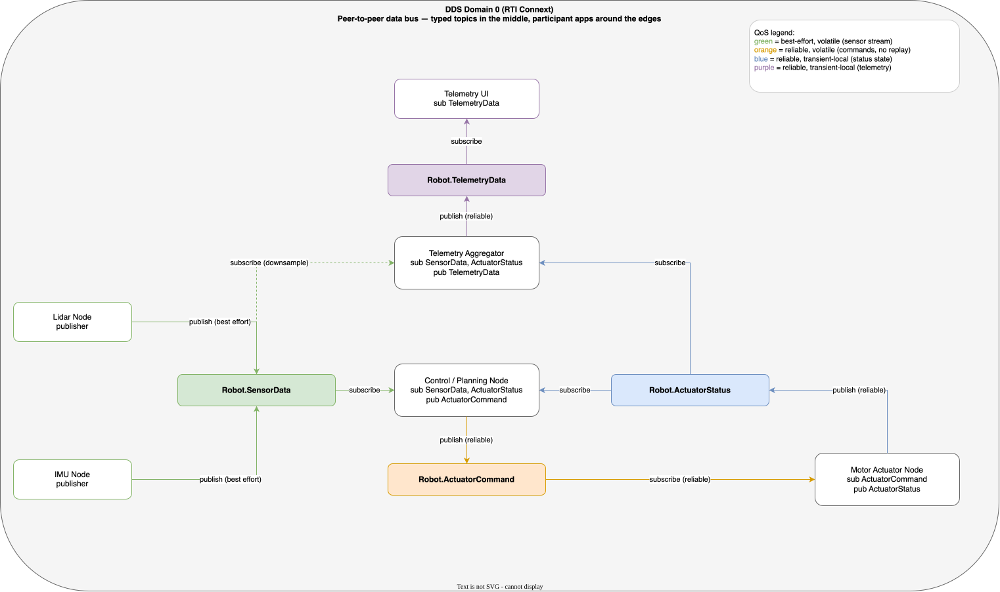

# Simple Robotic System (RTI Connext DDS)

A minimal but production-shaped robotics system built on RTI Connext Professional.
Four independent, typed DDS data flows keep producers, consumers, rates, and
delivery guarantees separate.

## Architecture



- Sensors publish directly to the controller (short, direct control path).
- The monitoring UI is kept out of the real-time loop via a telemetry aggregator.
- All nodes are peers in DDS Domain 0; no broker in the control path.

## Data model (`robot.idl`)

| Topic | Type | Key | Purpose |
|---|---|---|---|
| `Robot.SensorData` | `SensorData` | `sensorId` | Periodic sensor measurements |
| `Robot.ActuatorCommand` | `ActuatorCommand` | `actuatorId` | Discrete commands/events |
| `Robot.ActuatorStatus` | `ActuatorStatus` | `actuatorId` | Latest actuator state |
| `Robot.TelemetryData` | `TelemetryData` | `entityId` | Aggregated dashboard snapshot |

All strings and the telemetry sequence are bounded for predictable memory and
bandwidth. `commandId` correlates commands with acknowledgement.

## QoS (`QoS.xml`)

| Flow | Profile | Reliability | Durability | Rationale |
|---|---|---|---|---|
| Sensor → control | `SensorPeriodic` | Best effort | Volatile | Freshness > repairing old samples |
| Control → command | `ActuatorCommandEvent` | Reliable | Volatile | No silent loss, but old actions must NOT replay |
| Actuator → status | `ActuatorStatusState` | Reliable | Transient local | Late joiners get current state |
| Aggregator → UI | `TelemetrySnapshot` | Reliable | Transient local | Dashboard shows latest snapshot |

Deadlines (writer/reader) catch stale sensors and lost status. For commands,
rely on liveliness + an app-level watchdog instead of deadline, since commands
are sporadic.

## Apps (`src/`)

- `sensor_node <id> <kind> <unit> <periodMs>` — publishes `SensorData`
- `control_node <actuatorId> <sensorId>` — closed-loop `SET_VALUE` example
- `actuator_node <actuatorId> <statusPeriodMs>` — applies commands, publishes status
- `telemetry_node` — aggregates sensor+status into `TelemetryData`
- `telemetry_ui` — prints the latest dashboard snapshot

## Build & run

```sh
export NDDSHOME=/opt/rti_connext_dds-7.7.0
cmake -S . -B build
cmake --build build

# Terminal 1 (run from project dir so QoS.xml is found)
./build/sensor_node lidar-01 POSITION m 20
# Terminal 2
./build/control_node motor-left lidar-01
# Terminal 3
./build/actuator_node motor-left 100
# Terminal 4
./build/telemetry_node
# Terminal 5
./build/telemetry_ui
```

## Failure handling to implement next

- Sensor deadline missed → mark stale, degrade planning / stop motion.
- Actuator status deadline or liveliness lost → stop issuing motion commands.
- Controller liveliness lost → actuator watchdog → safe state.
- Security: restrict permissions so sensors can't write commands, UI is read-only.
